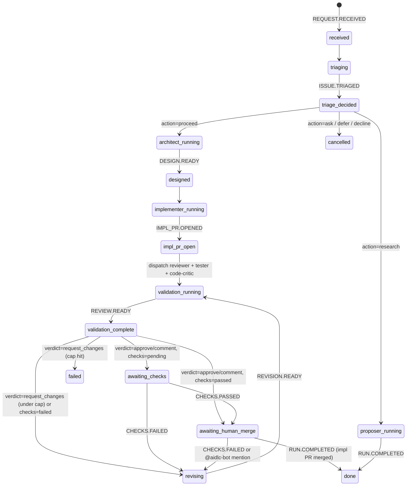

# Run Lifecycle & State Machine

One request produces one implementation PR. All coordination flows through DynamoDB + SQS + EventBridge.

## Pipeline Shape

```
REQUEST.RECEIVED
  -> ISSUE.TRIAGED
  -> DESIGN.READY
  -> IMPL_PR.OPENED
  -> REVIEW.READY + TEST_REPORT.READY + CODE_CRITIQUE.READY
  -> CHECKS.PASSED
  -> awaiting_human_merge
  -> RUN.COMPLETED
```

## Entry Paths

Two ways to start a run:

1. **GitHub issue webhook** -- an issue is assigned to the bot or a comment triggers it. The webhook handler builds an `IssueContext` (url, number, title, body, labels, triggering comment) and calls `start_run()`.
2. **Dashboard form** -- a user picks a repo and types an intent. The entry adapter publishes `REQUEST.RECEIVED` directly.

Both paths converge at `entry_adapter` publishing `REQUEST.RECEIVED` on EventBridge. There is no entry-side DDB write and no manual SQS beacon -- the projector and DDB Stream Pipe own the read-model and wake-up edge.

## Triage Classification

Issue-driven runs go through the Triage agent first. The agent classifies the issue into one of five verdicts:

| Verdict | Effect |
|---------|--------|
| `proceed` | Advance to Architect dispatch |
| `research` | Branch to Proposer (research-driven PR) |
| `ask` | Terminate run (comment on issue asking for clarification) |
| `defer` | Terminate run (not actionable now) |
| `decline` | Terminate run (out of scope) |

Programmatic runs (no source issue) skip triage and jump directly to the Architect.

## Architecture Phase

The Architect writes a structured `plan.md` to S3 (not committed to git). Sections:

1. Context
2. Assumptions
3. Approach
4. Files (to modify)
5. Reuse (existing patterns to leverage)
6. Implementation steps
7. Verification
8. Out of scope

## Implementation Phase

The Implementer opens one PR on branch `aidlc/impl/{run_id}`. Runs in `mode=implementation` for the initial pass. Emits `IMPL_PR.OPENED` on completion.

## Validation Lifecycle

Once `IMPL_PR.OPENED` is projected, the state-router dispatches three validators in parallel:

| Validator | Model | Role | Gating? |
|-----------|-------|------|---------|
| Reviewer | Sonnet 4.6 | Code review with verdict | Yes |
| Tester | Haiku 4.5 | Test gap analysis | No (advisory) |
| Code-Critic | Opus 4.6 | Adversarial review against original issue | No (advisory) |

All three write Markdown to `s3://{bucket}/runs/{run_id}/validation/{kind}-r{N}.md` where `N` is the revision number (0 for first pass).

### Reviewer Verdicts

The Reviewer's `REVIEW.READY` event carries a `verdict`:

- **`approve` / `comment`** -- state-router checks the PR's aggregate GitHub Check state via `repo_helper.get_check_state(pr_url)`:
  - Checks passed -> `awaiting_human_merge`
  - Checks pending -> `awaiting_checks`
  - Checks failed -> `revising` (CI-driven revision, counts toward cap)
- **`request_changes`** -- `revising`. Implementer runs in `mode=revision`.

The Reviewer also performs per-assumption checks: it verifies each architect assumption against the source issue text.

## Revision Triggers

While in `awaiting_checks` or `awaiting_human_merge`:

- `CHECKS.FAILED` (a required check went red) -> `revising` (counts toward automated cap)
- `IMPL.ITERATION_REQUESTED` (human `@aidlc-bot` mention) -> `revising` (uncapped)

In revision mode, the Implementer:
1. Clones the repo and checks out the impl branch
2. Reads validator artifacts from S3
3. Applies fixes
4. Pushes to the impl branch
5. Emits `REVISION.READY` -> back to `validation_running`

## Automated Revision Cap

`MAX_REVISIONS = 3` (defined in `dispatch_run.py`). This cap covers:
- Reviewer `request_changes` verdicts
- `CHECKS.FAILED` transitions

Exceeding the cap emits `RUN.FAILED` with `error_class="RevisionCapReached"`.

Human-mention revisions (`IMPL.ITERATION_REQUESTED`) are uncapped -- the human is actively steering.

## State Diagram



## Terminal States

- **done** -- PR merged (`RUN.COMPLETED`)
- **failed** -- revision cap hit or dispatch error (`RUN.FAILED`)
- **cancelled** -- triage declined, issue closed, or manual cancel (`RUN.CANCEL_REQUESTED`)

## Wildcard Transitions

`RUN.FAILED` and `RUN.CANCEL_REQUESTED` advance any non-terminal state to `failed` or `cancelled` respectively.

## The State Cursor

There is no separate state enum stored in DDB. The `decide()` function in `state_router` is a pure function over the event log. It reads the full sequence of `EVENT#*` rows for the run and computes the next action. This makes the state machine fully replay-safe and observable.

## Dispatch Markers (Idempotency)

Each agent dispatch leaves a `*.DISPATCHED` marker event. The `decide()` function uses the presence of these markers as idempotency proof -- if the marker for an action exists after the triggering event, `decide()` returns `Noop` instead of double-invoking.

Markers: `TRIAGE.DISPATCHED`, `ARCHITECT.DISPATCHED`, `IMPLEMENTER.DISPATCHED`, `VALIDATORS.DISPATCHED`, `PROPOSER.DISPATCHED`.

## Retrospector

Fires on every terminal event (capture mode) and weekly per destination (consolidate mode). Capture emits scored bullets to AgentCore Memory. Consolidate opens PRs for `MEMORY.md` additions and new skills. See `agents.md` for details.

## Proposer (Research Path)

When triage classifies a run as `research`, the Proposer agent is dispatched instead of the Architect. The Proposer reads external docs and opens PRs proposing prompt or `MEMORY.md` edits.
