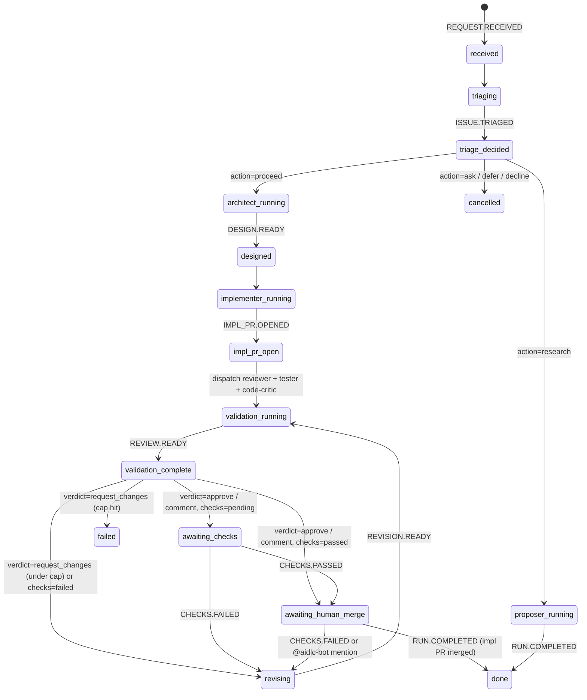

# ai-dlc — Project manifest

An agentic SDLC platform built on AWS Bedrock AgentCore.

## Tech stack

- **Python 3.14** with the Astral toolchain (`uv` workspace, `ruff`, `ty`).
- **Agents**: Strands Agents (Architect, Code-Critic, Reviewer, Tester, Triage, Proposer, Retrospector) and Claude Agent SDK (Implementer), all shipped as `linux/arm64` containers on Bedrock AgentCore Runtime. One issue → one impl PR. Architect's `plan.md` is an internal S3 artifact (no spec PR).
- **Models**: Architect / Code-Critic / Proposer → Claude Opus 4.6. Implementer / Reviewer → Claude Sonnet 4.6. Tester / Triage / Retrospector / memory consolidation → Claude Haiku 4.5.
- **Orchestration**: SQS-beacon + DynamoDB-state machine driven by a single `state_router` Lambda. The `event_projector` Lambda is the only writer of run state.
- **Eventing**: Amazon EventBridge (custom bus + schema registry), DynamoDB streams.
- **Memory**: AgentCore Memory (semantic + summarization strategies) plus per-project `MEMORY.md` files in the AgentCore Runtime persistent filesystem (snapshotted to S3).
- **Dashboard**: FastAPI + Jinja2 + Alpine.js (CDN, no JS build) on API Gateway + Lambda with Cognito OIDC auth.
- **Auth**: Amazon Cognito (single user pool covers ALB + API Gateway).
- **HITL**: GitHub PR reviews/comments → webhook → EventBridge event → `event_projector` advances DDB state → `state_router` dispatches the next side-effect.
- **IaC**: Terraform only (`hashicorp/aws ~> 6`).

## Key directories

| Path | Role |
|------|------|
| `packages/common/` | Shared library. Event envelopes (`events.py`, `event_emit.py`), state machine (`state.py`, `state_transitions.py`), routing rules (`routing.py`), AgentCore wrappers (`agentcore_*.py`), gateway-MCP plumbing (`gateway_tools.py`), boto3 helpers (`ddb.py`, `runs.py`), `MEMORY.md` parser + stack-profile S3 reader/writer (`memory_md.py`). |
| `agents/architect/` | Strands agent — writes a single structured `plan.md` to S3 (Context → Assumptions → Approach → Files → Reuse → Implementation steps → Verification → Out of scope). No PR. |
| `agents/code_critic/` | Strands agent — adversarially reviews the impl PR against the **original GitHub issue** (advisory; runs in parallel with reviewer + tester). |
| `agents/implementer/` | Claude Agent SDK agent — opens the single impl PR for the run (`mode=implementation`); also runs `mode=revision` to apply validator feedback, human `@aidlc-bot` mentions, and failing CI feedback directly onto the impl branch. |
| `agents/reviewer/` | Strands agent — code-reviews the impl PR. Its verdict gates the run (`approve`/`comment` → wait for green Checks; `request_changes` → revising). |
| `agents/tester/` | Strands agent — flags test gaps in the impl PR (advisory). |
| `agents/triage/` | Strands agent — classifies issue-driven runs (`proceed` / `ask` / `defer` / `decline` / `research`). |
| `agents/proposer/` | Strands agent — research-driven (issue → triage classifies as `research`); opens PRs proposing prompt or MEMORY.md edits. |
| `agents/retrospector/` | Strands agent — fires on every terminal event (PR merge, PR close, issue close); appends lessons to `MEMORY.md` via PR. |
| `lambdas/entry_adapter/` | API Gateway → DDB run row + EventBridge `REQUEST.RECEIVED` + SQS beacon. |
| `lambdas/state_router/` | SQS beacon consumer; reads DDB state and dispatches the next side-effect (agent invoke, repo op, event emit). Never writes state. |
| `lambdas/event_projector/` | EventBridge events → DDB state advance (sole writer of `current_state`) + AgentCore Memory `CreateEvent`. |
| `lambdas/artifact_tool/` | AgentCore Gateway target — S3 + `MEMORY.md` ops. |
| `lambdas/repo_helper/` | AgentCore Gateway target — git/GitHub ops, including the `get_check_state(pr_url)` aggregator that drives `CHECKS.PASSED` / `CHECKS.FAILED` events. |
| `lambdas/retrospector_dispatcher/` | EventBridge → AgentCore Runtime invocation for the Retrospector on every terminal event. |
| `services/dashboard/` | FastAPI submission/tracking UI. |
| `terraform/modules/` | Reusable Terraform modules (one per concern). |
| `terraform/envs/dev/` | Environment composition (prod TBD). |
| `terraform/bootstrap/` | One-time S3 + DDB state backend. |
| `docs/ADRs/` | Architectural Decision Records (written by the Architect agent). |
| `MEMORY.md` | Canonical human-reviewed project memory. |

## Memory model

`MEMORY.md` carries repository-scoped context (conventions, ADR bullets, constraints) and is reviewed in PRs. AgentCore Memory carries cross-session facts (user preferences, learned signals) and session events (≤60 days). Sync is one-way: MEMORY.md → AgentCore Memory on every successful session via `CreateEvent`. The reverse only happens through agent-proposed PR edits — humans gate writes to MEMORY.md.

## Request lifecycle

One request → one impl PR. All coordinated through DynamoDB + SQS + EventBridge. The two-Lambda split is load-bearing: `state_router` only reads DDB and triggers side-effects; `event_projector` is the sole writer of `current_state`. This keeps state machine logic in one place and makes every transition observable as an EventBridge event.

1. **Entry**: GitHub issue webhook (or dashboard form) → `entry_adapter` writes the run row to DDB (with `source_issue_url` / `_title` / `_body` if issue-driven), emits `REQUEST.RECEIVED` on EventBridge, sends an SQS beacon.
2. **Dispatch**: `state_router` consumes the beacon, reads `current_state` from DDB, looks up the handler in `dispatch.py` / `dispatch_run.py`, executes the side-effect (invoke AgentCore Runtime, call a repo op, emit an event). Never writes state.
3. **Agent work**: the invoked agent emits a domain event (e.g. `DESIGN.READY`, `IMPL_PR.OPENED`, `REVIEW.READY`) back to EventBridge.
4. **Projection**: `event_projector` consumes the event, advances `current_state` per `state_transitions.py`, calls AgentCore Memory `CreateEvent`, and enqueues the next SQS beacon if the new state needs dispatch.
5. **HITL**: GitHub PR review/comment with `@aidlc-bot` mention → webhook → `IMPL.ITERATION_REQUESTED` → projector advances to `revising` → state-router invokes implementer in `mode=revision`. CI workflow runs → webhook aggregates check state → `CHECKS.PASSED` / `CHECKS.FAILED` → projector advances. Humans gate the run by merging the impl PR (`pull_request.closed merged=true` → `RUN.COMPLETED`).
6. **Terminal events** (`RUN.COMPLETED` / `RUN.FAILED` / `RUN.CANCEL_REQUESTED`) fan out via `retrospector_dispatcher` to the Retrospector agent for the lesson-extraction pass.

The run-level state cursor (`RunState` in `packages/common/src/common/state.py`) walks one path of this diagram. Exact event→state transitions are encoded in `RUN_TRANSITIONS` (`state_transitions.py`):



`RUN.FAILED` and `RUN.CANCEL_REQUESTED` are wildcard transitions: they advance any non-terminal state to `failed` or `cancelled` respectively. No more per-task cursor — the implementer handles the issue end-to-end on a single branch (`aidlc/impl/{run_id}`) and opens one PR.

### Validation lifecycle

Once the implementer opens the impl PR (`IMPL_PR.OPENED`), the state-router dispatches three validators **in parallel** against the PR:

- **Reviewer** (Sonnet 4.6) — code review with a verdict (`approve` / `comment` / `request_changes`). Drives the next state transition.
- **Tester** (Haiku 4.5) — test-gap analysis. Advisory; informs the reviewer + implementer.
- **Code-Critic** (Opus 4.6) — adversarial review of how well the PR addresses the **original GitHub issue** (its input includes the issue title + body). Advisory.

All three write Markdown artifacts to `s3://{artifacts_bucket}/runs/{run_id}/validation/{kind}-r{N}.md` where `N` is the revision number (0 for the first pass, 1+ after each implementer revision).

Reviewer's `REVIEW.READY` carries a `verdict`:

- `approve` / `comment` → state-router checks the PR's aggregate GitHub Check state via `repo_helper.get_check_state(pr_url)`. If passed → `awaiting_human_merge`; if pending → `awaiting_checks`; if failed → `revising` (CI-driven revision, counts toward cap).
- `request_changes` → `revising`. The state-router invokes the implementer in `mode=revision`: clone the repo, check out the impl branch, read the three validator artifacts from S3, apply fixes, push. Emits `REVISION.READY` → back to `validation_running`.

While in `awaiting_checks` or `awaiting_human_merge`, two additional signals trigger revisions:

- `CHECKS.FAILED` (a required check went red) → `revising` (counts toward cap).
- `IMPL.ITERATION_REQUESTED` (human `@aidlc-bot` mention on the PR) → `revising` (**uncapped** — the human is actively steering).

The automated revision loop (validator-driven + CI-driven) is capped at `MAX_REVISIONS = 3` (in `dispatch_run.py`); exceeding the cap emits `RUN.FAILED`. Human-mention revisions are uncapped. The human merges the PR via the normal GitHub UI when it's ready.

## Adding a new agent

1. `cp -r agents/architect agents/<name>` and rename module + Dockerfile entrypoint.
2. Add the package as a workspace member (no action needed if it lives under `agents/*`).
3. Implement the agent in `src/<name>/agent.py` and the AgentCore Runtime shell in `src/<name>/app.py`.
4. Register the agent in `terraform/modules/agents/variables.tf` (`var.agents`); apply (creates IAM, gateway, workload identity — no ECR repo, no runtime yet).
5. Push the image via the `images-build` workflow. The ECR repo `${project}/<name>` is auto-created on first push by `aws_ecr_repository_creation_template.agents` with the standard config (immutable except `latest`, lifecycle policy, AgentCore-pull policy).
6. Add `<name> = "latest"` to `agent_image_tags` in `terraform/envs/<env>/main.tf` and apply again to create the AgentCore Runtime.
7. Add the corresponding state(s) to `packages/common/src/common/state.py`, transitions to `packages/common/src/common/state_transitions.py`, and a dispatch handler in `lambdas/state_router/src/state_router/dispatch_run.py` — only if the agent participates in the run state machine (out-of-band agents like the retrospector skip this step).

## Target-repo prerequisites

The platform writes one branch per run under `aidlc/impl/{run_id}` and opens one PR from it. Every target repo must be configured as follows:

- **Settings → General → "Automatically delete head branches"**: enable. Impl branches (`aidlc/impl/{run_id}`) are removed on PR merge so old runs don't accumulate.
- **Branch protection on `aidlc/impl/*`**: optional. The platform does not server-side-merge into impl branches anymore (no task branches to merge); a human merges the impl PR via the GitHub UI when validators + Checks are green. Branch protection requiring CI to pass before merge is compatible with the platform and recommended.

## Running tests

```bash
uv run pytest -q                                     # unit tests only
uv run pytest -m integration                          # moto-backed integration
uv run pytest -m live_aws tests/integration/...       # full end-to-end against dev account (gated)
```

## Deploying

Image build and Terraform apply are GitHub Actions workflows. Production applies require manual approval via GitHub Environments.

```bash
gh workflow run images-build.yml --ref main           # all eight agents → ECR
gh workflow run dashboard-build.yml --ref main         # dashboard container → ECR + ECS update-service
gh workflow run terraform-apply.yml --ref main         # apply (dev auto, prod gated)
```

## Local development

Each agent runs unchanged on a laptop — Strands' `Agent` and Claude Agent SDK's `ClaudeSDKClient` produce the same behaviour locally and on AgentCore Runtime.

```bash
cd agents/architect && uv sync && AIDLC_ENV=dev uv run python -m architect.app
# Hit it on :8080/invocations with the Bedrock AgentCore session header.
```

The dashboard runs locally with `uv run uvicorn dashboard.app:app --reload --port 8080` from `services/dashboard/`. Cognito OIDC is bypassed in dev mode (set `AIDLC_AUTH=disabled`).

## Terraform (local)

`terraform.tfvars` and `backend.hcl` are gitignored. On first checkout, copy the `.example` template and supply the partial backend config:

```bash
cd terraform/envs/dev
cp terraform.tfvars.example terraform.tfvars        # then fill in real values
terraform init -reconfigure \
  -backend-config="bucket=<state-bucket-name>" \
  -backend-config="profile=aidlc-admin"
```

`-reconfigure` is required the first time after `backend.tf` was converted to a partial config. The state bucket name and AWS profile can also live in a gitignored `terraform/envs/dev/backend.hcl` invoked via `-backend-config=backend.hcl`. CI supplies `bucket` from the `TF_STATE_BUCKET` repo variable and leaves `profile` empty so the S3 backend falls through to OIDC env-var creds.

## Lint, type, test policy

Inherits the global `~/.claude/CLAUDE.md` standards (≤100 lines/function, complexity ≤8, ≤5 positional params, 100-char lines, absolute imports, Google-style docstrings, zero warnings). Project-specific overrides: none.

## Implementer guardrails (deny-list, enforced by hooks)

- Any `rm -rf /`, `rm -rf $HOME`, `chmod -R 777`, `git push --force-with-lease origin main`.
- Any `aws iam *Delete*`, `terraform apply` against `prod`, `kubectl delete`, `dropdb` / `DROP TABLE`.
- Direct GitHub OAuth tokens or Bedrock model API keys in code.

The implementer container has outbound network access (`Bash` / `WebFetch` / `WebSearch`). Container credentials are scoped (Bedrock + project S3 + GitHub App for the target repo) and the only path code reaches the repo is a human-reviewed PR — that's the load-bearing control, not egress filtering.
